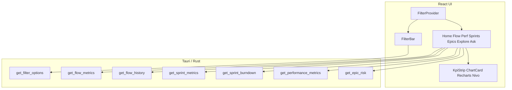

# Insights Dashboard UI Implementation Plan

> **For agentic workers:** REQUIRED SUB-SKILL: Use superpowers:subagent-driven-development (recommended) or superpowers:executing-plans to implement this plan task-by-task. Steps use checkbox (`- [ ]`) syntax for tracking.

**Goal:** Ship a full insights dashboard with global dropdown filters, Recharts/Nivo charts, KPI strips on Home/Flow/Performance/Sprints/Epics, plus WIP, CFD, and sprint burndown.

**Architecture:** Add `get_filter_options`, `get_flow_history`, and `get_sprint_burndown` Tauri commands (Rust analytics + SQLite). Wrap insights routes in `DashboardShell` + `FilterProvider`. Replace free-text `FilterBar` with searchable multi-selects. Introduce `KpiStrip` / `ChartCard` and redesign each insights page against existing + new metrics.

**Tech Stack:** Rust (`ag_analytics`, `src-tauri` commands), SQLite, React 19, react-router-dom 7, Recharts, `@nivo/heatmap`, Vitest, existing A&G CSS tokens.

**Spec:** [`docs/superpowers/specs/2026-07-23-insights-dashboard-ui-design.md`](../specs/2026-07-23-insights-dashboard-ui-design.md)

## Global Constraints

- Local-only; no hosted backend
- Reuse `MetricsFilter` shape (`project_keys`, `from`, `to`, `issue_types`, `assignee_ids`)
- Metrics stay in Rust/SQL — UI is presentational
- TDD for new Rust series and UI filter/chart smoke tests
- Keep A&G brand tokens / IBM Plex in `ui/src/styles.css` (no purple/dark-mode redesign)
- Chart libs: `recharts` + `@nivo/heatmap` only
- CFD uses status **categories** mapped from `StatusFlowCategory`: Waiting→todo, Active→in_progress, Terminal→done
- Filter persistence: `sessionStorage` key `ag.filters.v1` (no URL sync)
- Sync/Settings routes have no FilterBar
- Display names from filter catalog; never invent a full Jira user sync table in this plan

## File map

| Path | Responsibility |
|------|----------------|
| `crates/ag_analytics/src/flow_history.rs` | Pure WIP/CFD daily reconstruction from transitions |
| `crates/ag_analytics/src/sprint_burndown.rs` | Pure burndown series from sprint membership + completions |
| `crates/ag_analytics/src/lib.rs` | Export new modules |
| `src-tauri/src/commands/metrics.rs` | DTOs + `get_filter_options_inner`, `get_flow_history_inner`, `get_sprint_burndown_inner` + tauri cmds |
| `src-tauri/src/lib.rs` | Register new invoke handlers |
| `src-tauri/src/commands/mod.rs` | Re-exports |
| `ui/package.json` | Add `recharts`, `@nivo/heatmap` |
| `ui/src/lib/tauri.ts` | Types + invoke wrappers for new commands |
| `ui/src/lib/filters.tsx` | `FilterProvider`, `useFilters`, defaults, sessionStorage |
| `ui/src/lib/filterOptions.tsx` | Load/cache `getFilterOptions` + `usePersonLabel` |
| `ui/src/components/MultiSelect.tsx` | Searchable multi-select control |
| `ui/src/components/FilterBar.tsx` | Dropdown FilterBar |
| `ui/src/components/KpiStrip.tsx` | KPI cards |
| `ui/src/components/ChartCard.tsx` | Chart wrapper (loading/empty/error) |
| `ui/src/components/DashboardShell.tsx` | Nav + FilterBar + children |
| `ui/src/components/MetricChart.tsx` | Remove after Flow migrates (or thin re-export deleted) |
| `ui/src/App.tsx` | Shell layout routes; FilterProvider |
| `ui/src/styles.css` | Wider dashboard, filter chips, chart grid |
| `ui/src/pages/HomePage.tsx` | Layout A redesign |
| `ui/src/pages/FlowPage.tsx` | Charts + WIP/CFD |
| `ui/src/pages/PerformancePage.tsx` | Chart-first + heatmap |
| `ui/src/pages/SprintsPage.tsx` | Charts + burndown |
| `ui/src/pages/EpicsPage.tsx` | Risk charts + list finish-by % |
| `ui/src/pages/ExplorePage.tsx` | Shell + person labels |
| `ui/src/pages/AskAiPage.tsx` | Shell + shared filters |



---

### Task 1: `get_filter_options` (Rust)

**Files:**
- Modify: `src-tauri/src/commands/metrics.rs`
- Modify: `src-tauri/src/lib.rs`
- Modify: `src-tauri/src/commands/mod.rs`
- Test: `src-tauri/src/commands/metrics.rs` (`#[cfg(test)]`)

**Interfaces:**
- Produces:
```rust
pub struct FilterProjectOption { pub key: String, pub name: String, pub issue_count: i64 }
pub struct FilterTypeOption { pub value: String, pub count: i64 }
pub struct FilterAssigneeOption { pub id: String, pub label: String, pub count: i64 }
pub struct FilterOptionsDto {
  pub projects: Vec<FilterProjectOption>,
  pub issue_types: Vec<FilterTypeOption>,
  pub assignees: Vec<FilterAssigneeOption>,
}
pub fn get_filter_options_inner(state: &AppState) -> Result<FilterOptionsDto, String>
```
- Assignee `label`: prefer latest non-empty changelog `to_string`/`from_string` for field `assignee` matching that account id; else truncate id to 8 chars.

- [ ] **Step 1: Write the failing test**

```rust
#[test]
fn filter_options_lists_projects_types_and_assignee_labels() {
    let dir = tempdir().unwrap();
    let db = dir.path().join("t.db");
    // migrate + insert project DEMO, issue Story assignee "acc-1",
    // changelog assignee to_string "Ada Lovelace" to_value "acc-1"
    let state = test_state(&db);
    let opts = get_filter_options_inner(&state).unwrap();
    assert_eq!(opts.projects[0].key, "DEMO");
    assert!(opts.issue_types.iter().any(|t| t.value == "Story"));
    let ada = opts.assignees.iter().find(|a| a.id == "acc-1").unwrap();
    assert_eq!(ada.label, "Ada Lovelace");
}
```

(Follow existing metrics tests for `tempdir` + schema migrate helpers already in the module.)

- [ ] **Step 2: Run test to verify it fails**

Run: `cargo test -p aandg-analytics-tauri filter_options_lists -- --nocapture`  
(Use the actual package name from `src-tauri/Cargo.toml` if different — check with `cargo metadata`.)  
Expected: FAIL — `get_filter_options_inner` not found

- [ ] **Step 3: Implement DTOs + `get_filter_options_inner` + tauri command**

SQL sketches:
- Projects: `SELECT p.key, p.name, COUNT(i.id) FROM projects p LEFT JOIN issues i ON i.project_key = p.key GROUP BY p.key`
- Types: `SELECT issue_type, COUNT(*) FROM issues WHERE issue_type IS NOT NULL GROUP BY issue_type`
- Assignees: distinct `assignee_account_id` from issues; labels via subquery on `issue_changelog` where `lower(field)='assignee'`

Register `get_filter_options` in `tauri_cmds` and `lib.rs` invoke_handler.

- [ ] **Step 4: Run test to verify it passes**

Run: same as Step 2 — Expected: PASS

- [ ] **Step 5: Commit**

```bash
git add src-tauri/src/commands/metrics.rs src-tauri/src/lib.rs src-tauri/src/commands/mod.rs
git commit -m "feat(metrics): add get_filter_options catalog command"
```

---

### Task 2: UI types + `FilterProvider`

**Files:**
- Modify: `ui/src/lib/tauri.ts`
- Create: `ui/src/lib/filters.tsx`
- Create: `ui/src/lib/filters.test.tsx`
- Create: `ui/src/lib/filterOptions.tsx`

**Interfaces:**
- Produces:
```ts
export type FilterOptions = {
  projects: { key: string; name: string; issue_count: number }[];
  issue_types: { value: string; count: number }[];
  assignees: { id: string; label: string; count: number }[];
};
export function getFilterOptions(): Promise<FilterOptions>;
export function defaultMetricsFilter(now?: Date): MetricsFilter; // last 90 days
export function FilterProvider({ children }: { children: React.ReactNode }): JSX.Element;
export function useFilters(): { filter: MetricsFilter; setFilter: (f: MetricsFilter) => void; clearFilters: () => void };
```

- [ ] **Step 1: Write failing tests for default range + session persistence**

```tsx
it('defaultMetricsFilter uses last 90 days', () => {
  const f = defaultMetricsFilter(new Date('2026-07-23T12:00:00Z'));
  expect(f.from).toBe('2026-04-24');
  expect(f.to).toBe('2026-07-23');
});

it('FilterProvider restores from sessionStorage', () => {
  sessionStorage.setItem('ag.filters.v1', JSON.stringify({
    project_keys: ['DEMO'], from: '2026-01-01', to: '2026-01-31',
    issue_types: null, assignee_ids: null,
  }));
  // render provider + consumer reading useFilters().filter.project_keys
  expect(screen.getByTestId('keys')).toHaveTextContent('DEMO');
});
```

- [ ] **Step 2: Run test — expect FAIL**

Run: `cd ui && npm test -- src/lib/filters.test.tsx`  
Expected: FAIL — module missing

- [ ] **Step 3: Implement `getFilterOptions` in tauri.ts, `filters.tsx`, `filterOptions.tsx`**

`filterOptions.tsx` loads options once on mount (`getFilterOptions`), exposes `useFilterOptions()` and `usePersonLabel(id: string | null): string`.

Keep `emptyMetricsFilter()` for “clear” (all null). Use `defaultMetricsFilter()` as provider initial state when session empty.

- [ ] **Step 4: Run tests — expect PASS**

- [ ] **Step 5: Commit**

```bash
git add ui/src/lib/tauri.ts ui/src/lib/filters.tsx ui/src/lib/filters.test.tsx ui/src/lib/filterOptions.tsx
git commit -m "feat(ui): FilterProvider with session persistence and catalog types"
```

---

### Task 3: Dropdown `FilterBar` + `MultiSelect`

**Files:**
- Create: `ui/src/components/MultiSelect.tsx`
- Create: `ui/src/components/MultiSelect.test.tsx`
- Modify: `ui/src/components/FilterBar.tsx`
- Modify: `ui/src/components/FilterBar.test.tsx`
- Modify: `ui/src/styles.css` (filter chips / dropdown)

**Interfaces:**
- Consumes: `MetricsFilter`, `useFilterOptions`, `onChange`
- Produces: FilterBar with no free-text project/type/assignee inputs

- [ ] **Step 1: Failing FilterBar test — no text placeholders for projects**

```tsx
it('uses multi-selects for projects issue types and assignees', async () => {
  vi.mocked(tauri.getFilterOptions).mockResolvedValue({
    projects: [{ key: 'DEMO', name: 'Demo', issue_count: 2 }],
    issue_types: [{ value: 'Story', count: 2 }],
    assignees: [{ id: 'acc-1', label: 'Ada', count: 1 }],
  });
  render(
    <FilterOptionsProvider>
      <FilterBar value={empty} onChange={onChange} />
    </FilterOptionsProvider>,
  );
  expect(screen.queryByPlaceholderText(/KEY1/i)).not.toBeInTheDocument();
  await userEvent.click(screen.getByRole('button', { name: /projects/i }));
  await userEvent.click(await screen.findByRole('option', { name: /Demo/i }));
  expect(onChange).toHaveBeenCalledWith(expect.objectContaining({
    project_keys: ['DEMO'],
  }));
});
```

Also test date preset “Last 30 days” sets `from`/`to`.

- [ ] **Step 2: Run — expect FAIL**

Run: `cd ui && npm test -- src/components/FilterBar.test.tsx`

- [ ] **Step 3: Implement `MultiSelect` + rewrite `FilterBar`**

Controls:
- Projects / Issue types / Assignees → `MultiSelect`
- From / To date inputs retained
- Preset buttons: 7d, 30d, 90d, This quarter
- Chips for active selections + Clear all → `emptyMetricsFilter()` then caller may re-apply defaults via `clearFilters` from provider

Wire FilterBar to either props (`value`/`onChange`) **or** optionally `useFilters()` — keep props API so tests stay simple; shell passes provider values.

- [ ] **Step 4: Run — expect PASS**

- [ ] **Step 5: Commit**

```bash
git add ui/src/components/MultiSelect.tsx ui/src/components/MultiSelect.test.tsx ui/src/components/FilterBar.tsx ui/src/components/FilterBar.test.tsx ui/src/styles.css
git commit -m "feat(ui): replace free-text filters with searchable dropdowns"
```

---

### Task 4: `DashboardShell` + App routing

**Files:**
- Create: `ui/src/components/DashboardShell.tsx`
- Modify: `ui/src/App.tsx`
- Modify: `ui/src/App.test.tsx`
- Modify: insight pages to remove local FilterBar + local filter state (can do incrementally; this task at least wraps routes)

**Interfaces:**
```tsx
function DashboardShell({ current, title, children }: {
  current: NavPage; title: string; children: React.ReactNode;
}): JSX.Element
// Renders header+nav, FilterBar from useFilters(), then children
```

- [ ] **Step 1: Update App.test to mock `getFilterOptions` + `getPerformanceMetrics`**

Ensure home still renders under credentials. Add assertion FilterBar projects control exists on `/`.

- [ ] **Step 2: Run App.test — adjust until RED only for missing shell**

- [ ] **Step 3: Implement shell; wrap insights routes**

Pattern:
```tsx
<Route element={<RequireCredentials><FilterProvider><FilterOptionsProvider><Outlet/></FilterOptionsProvider></FilterProvider></RequireCredentials>}>
  <Route path="/" element={<HomePage />} />
  ...
</Route>
```

Each page uses `DashboardShell` and `useFilters()` instead of local `useState(emptyMetricsFilter)`.

For this task: wire Home + Flow at minimum to prove shared filter; remaining pages in later tasks if time — **required:** all insights pages must use shell before Task 13 completes.

- [ ] **Step 4: Run UI tests — PASS for App + FilterBar**

- [ ] **Step 5: Commit**

```bash
git add ui/src/App.tsx ui/src/App.test.tsx ui/src/components/DashboardShell.tsx ui/src/pages/*.tsx
git commit -m "feat(ui): DashboardShell with global shared filters"
```

---

### Task 5: Chart kit + dependencies + layout width

**Files:**
- Modify: `ui/package.json` (add deps)
- Create: `ui/src/components/KpiStrip.tsx`, `KpiStrip.test.tsx`
- Create: `ui/src/components/ChartCard.tsx`, `ChartCard.test.tsx`
- Modify: `ui/src/styles.css` — `.dashboard-page { max-width: 80rem; }` + chart grid helpers

**Interfaces:**
```tsx
type Kpi = { id: string; label: string; value: string };
function KpiStrip({ items }: { items: Kpi[] }): JSX.Element;

function ChartCard({ title, loading?, error?, empty?, children }: {
  title: string;
  loading?: boolean;
  error?: string | null;
  empty?: boolean;
  children: React.ReactNode;
}): JSX.Element;
```

- [ ] **Step 1: Failing tests for KpiStrip / ChartCard empty state**

```tsx
it('shows empty message when empty', () => {
  render(<ChartCard title="Throughput" empty>unused</ChartCard>);
  expect(screen.getByText(/no data for current filters/i)).toBeInTheDocument();
});
```

- [ ] **Step 2: Run — FAIL**

- [ ] **Step 3: `npm install recharts @nivo/heatmap` in `ui/`; implement components + CSS**

- [ ] **Step 4: Run component tests — PASS**

- [ ] **Step 5: Commit**

```bash
git add ui/package.json ui/package-lock.json ui/src/components/KpiStrip.tsx ui/src/components/KpiStrip.test.tsx ui/src/components/ChartCard.tsx ui/src/components/ChartCard.test.tsx ui/src/styles.css
git commit -m "feat(ui): add KpiStrip, ChartCard, and chart dependencies"
```

---

### Task 6: `get_flow_history` (WIP + CFD) in Rust

**Files:**
- Create: `crates/ag_analytics/src/flow_history.rs`
- Modify: `crates/ag_analytics/src/lib.rs`
- Modify: `src-tauri/src/commands/metrics.rs`
- Modify: `src-tauri/src/lib.rs`

**Interfaces:**
```rust
// ag_analytics
pub struct FlowHistoryPoint {
  pub day: String, // YYYY-MM-DD
  pub wip: i64,
  pub todo: i64,
  pub in_progress: i64,
  pub done: i64,
}
/// Build daily series from per-issue status timelines.
pub fn build_flow_history(
  issue_timelines: &[IssueStatusTimeline],
  from: NaiveDate,
  to: NaiveDate,
  overrides: &BTreeMap<String, StatusFlowCategory>,
) -> Vec<FlowHistoryPoint>;

pub struct IssueStatusTimeline {
  pub issue_id: String,
  /// (at, status_name) sorted ascending; status after each transition
  pub transitions: Vec<(DateTime<Utc>, String)>,
  pub created: DateTime<Utc>,
  pub initial_status: String,
}
```

Mapping: `Waiting→todo`, `Active→in_progress`, `Terminal→done`.  
WIP = todo + in_progress.  
If range span > 180 days, bucket weekly (Monday keys) — document in function docs.

Tauri:
```rust
pub struct FlowHistoryDto {
  pub days: Vec<String>,
  pub wip: Vec<i64>,
  pub cfd: CfdDto, // todo, in_progress, done: Vec<i64>
}
pub fn get_flow_history_inner(state: &AppState, filter: MetricsFilter) -> Result<FlowHistoryDto, String>
```

Load issues matching filter (ignore date for membership? **Spec:** series over `from`…`to`; include issues that existed in range — created <= day and not irrelevant). Practical rule: include issue if `created <= to` and (resolved is null or resolved >= from or any transition in range).

- [ ] **Step 1: Unit test in `flow_history.rs`**

```rust
#[test]
fn cfd_moves_issue_from_todo_to_done_across_days() {
  // created day0 To Do; day1 → In Progress; day2 → Done
  // assert day0: todo=1; day1: in_progress=1; day2: done=1; wip day0=1 day2=0
}
```

- [ ] **Step 2: `cargo test -p ag_analytics cfd_moves` — FAIL**

- [ ] **Step 3: Implement `build_flow_history` + command wiring + integration test with SQLite fixture**

- [ ] **Step 4: Tests PASS**

- [ ] **Step 5: Commit**

```bash
git add crates/ag_analytics/src/flow_history.rs crates/ag_analytics/src/lib.rs src-tauri/src/commands/metrics.rs src-tauri/src/lib.rs
git commit -m "feat(analytics): WIP and CFD flow history series"
```

---

### Task 7: Flow page redesign

**Files:**
- Modify: `ui/src/pages/FlowPage.tsx`
- Modify: `ui/src/pages/FlowPage.test.tsx`
- Modify: `ui/src/lib/tauri.ts` (`getFlowHistory`)
- Delete usage of `MetricChart` on this page

**UI content (from spec):**
- `KpiStrip`: cycle p50/p85, lead p50/p85, flow efficiency, reopens, handoffs, current WIP (last WIP point)
- Charts: Throughput area; CFD stacked area; WIP line; Bottlenecks bar; Cycle vs lead bar
- Secondary: daily throughput table

- [ ] **Step 1: Failing test looks for CFD / WIP chart labels**

```tsx
expect(await screen.findByRole('region', { name: /cumulative flow/i })).toBeInTheDocument();
expect(screen.getByRole('region', { name: /wip/i })).toBeInTheDocument();
```

Mock `getFlowMetrics` + `getFlowHistory`.

- [ ] **Step 2: Run — FAIL**

- [ ] **Step 3: Implement FlowPage with Recharts inside ChartCard**

Example CFD:
```tsx
<AreaChart data={rows}>
  <Area dataKey="todo" stackId="1" />
  <Area dataKey="in_progress" stackId="1" />
  <Area dataKey="done" stackId="1" />
</AreaChart>
```

- [ ] **Step 4: Tests PASS**

- [ ] **Step 5: Commit**

```bash
git add ui/src/pages/FlowPage.tsx ui/src/pages/FlowPage.test.tsx ui/src/lib/tauri.ts
git commit -m "feat(ui): Flow insights with throughput, CFD, and WIP charts"
```

---

### Task 8: Home redesign (layout A)

**Files:**
- Modify: `ui/src/pages/HomePage.tsx`
- Modify: `ui/src/pages/HomePage.test.tsx`

**UI:**
- KPIs: Cycle p50, Throughput sum, latest sprint velocity (`getSprintMetrics` last by list order / max id), at-risk epic count
- Throughput area; movers bars (PersonLabel); bottleneck bars; top risks list linking to `/epics`
- Optional WIP spark from `getFlowHistory`

- [ ] **Step 1: Test expects KPI labels Cycle / Throughput / At-risk and chart region Throughput**

Mock flow, performance, epic risk, sprint metrics, flow history.

- [ ] **Step 2: FAIL → Step 3 implement → Step 4 PASS → Step 5 commit**

```bash
git commit -m "feat(ui): Home KPI rail and spotlight charts"
```

---

### Task 9: Performance page redesign + Nivo heatmap

**Files:**
- Modify: `ui/src/pages/PerformancePage.tsx`
- Modify: `ui/src/pages/PerformancePage.test.tsx`

**UI:**
- KPIs: completions, points, open, blocked time (aggregate from `by_project`)
- Bar: top people (labels via `usePersonLabel`)
- Bar: top projects
- `@nivo/heatmap` for `person_month` (months × people, value = completed_count) — limit to top 15 people by total completions to keep readable
- Multi-line: `project_month` top projects
- Keep existing tables below as drill-down

- [ ] **Step 1: Test finds heatmap container / “People” chart**

- [ ] **Step 2–5: TDD implement + commit**

```bash
git commit -m "feat(ui): Performance chart-first view with person-month heatmap"
```

---

### Task 10: `get_sprint_burndown` (Rust)

**Files:**
- Create: `crates/ag_analytics/src/sprint_burndown.rs`
- Modify: `crates/ag_analytics/src/lib.rs`
- Modify: `src-tauri/src/commands/metrics.rs`
- Modify: `src-tauri/src/lib.rs`

**Interfaces:**
```rust
pub struct SprintBurndownPoint {
  pub day: String,
  pub remaining_issues: i64,
  pub remaining_points: Option<f64>,
  pub ideal_remaining_issues: i64,
}
pub fn build_sprint_burndown(
  start: NaiveDate,
  end: NaiveDate,
  issues: &[(String /*issue_id*/, Option<f64> /*points*/, Option<NaiveDate> /*completed_on*/)],
) -> Vec<SprintBurndownPoint>;
```

Ideal: linear from `issues.len()` on start to `0` on end (inclusive day count).  
Remaining on day D: count of issues with `completed_on` null or `> D`.

```rust
pub fn get_sprint_burndown_inner(state: &AppState, sprint_id: String) -> Result<SprintBurndownDto, String>
```

- [ ] **Step 1: Unit test — 2 issues, one done mid-sprint**

- [ ] **Step 2: FAIL → Step 3 implement + SQLite integration → Step 4 PASS → Step 5 commit**

```bash
git commit -m "feat(analytics): sprint burndown series command"
```

---

### Task 11: Sprints page redesign

**Files:**
- Modify: `ui/src/pages/SprintsPage.tsx`
- Modify: `ui/src/pages/SprintsPage.test.tsx`
- Modify: `ui/src/lib/tauri.ts`

**UI:**
- KPIs: avg completion %, avg spillover, latest velocity, scope churn sum(added−removed)
- Grouped bar: committed vs completed
- Line: velocity
- Stacked bar: scope_added / scope_removed
- Burndown ChartCard + `<select>` of sprints (default latest with dates — if burndown errors, show message)
- Table with % complete = completed/committed

- [ ] **Step 1: Test finds Burndown region and Scope chart**

- [ ] **Step 2–5: implement + commit**

```bash
git commit -m "feat(ui): Sprints charts including burndown and scope churn"
```

---

### Task 12: Epics page redesign

**Files:**
- Modify: `ui/src/pages/EpicsPage.tsx`
- Modify: `ui/src/pages/EpicsPage.test.tsx`

**UI:**
- KPIs: at-risk count (score ≥ threshold or top-N heuristic: count where score >= 0.5 if scores are 0–1 — **use same score domain as existing UI**; if scores are unbounded, “at-risk” = top quartile or score > median — prefer: count where `finish_by_probability` is Some and `< 0.5`, else count where score is among top 25% )
- Simpler locked rule: **at-risk count = epics with `finish_by_probability < 0.5` when present, else epics with score in the highest quartile**
- Avg risk score; avg finish-by probability (ignore nulls)
- Bar: risk scores by epic_key
- Scatter: finish_by_probability vs score
- Table columns: key, score, finish_by_probability, drivers
- Keep finish-by date probe for selected epic

- [ ] **Step 1: Test shows finish-by % in table and chart regions**

- [ ] **Step 2–5: implement + commit**

```bash
git commit -m "feat(ui): Epics risk charts and list-level finish-by probability"
```

---

### Task 13: Explore + Ask AI shell + person labels; remove MetricChart

**Files:**
- Modify: `ui/src/pages/ExplorePage.tsx`, `ExplorePage.test.tsx`
- Modify: `ui/src/pages/AskAiPage.tsx`, `AskAiPage.test.tsx`
- Delete: `ui/src/components/MetricChart.tsx` if unused
- Grep for remaining local FilterBar / `emptyMetricsFilter` state on insights pages

- [ ] **Step 1: Explore test — assignee cell shows catalog label “Ada” not raw id when options mock provides it**

- [ ] **Step 2–4: Wire shell filters; PersonLabel in Explore table**

- [ ] **Step 5: Commit**

```bash
git commit -m "feat(ui): shared filters on Explore and Ask AI; drop MetricChart"
```

---

### Task 14: Cross-page QA checklist + docs touch

**Files:**
- Create or update: `docs/superpowers/specs/2026-07-23-insights-dashboard-ui-design.md` status note if needed
- Manual checklist in plan completion comment / short `docs/superpowers/plans/` note optional — prefer verify commands:

- [ ] **Step 1: Run full test suites**

```bash
cd /Users/Taylor/Code/AandGAnalytics
cargo test --workspace
cd ui && npm test && npm run lint && npm run build
```

Expected: all PASS

- [ ] **Step 2: Manual smoke (desktop)**

1. Sync sample data  
2. Home filters → navigate Flow → same projects  
3. Confirm CFD/WIP/burndown render  
4. Performance heatmap labels readable  
5. Clear filters works  

- [ ] **Step 3: Commit any fixups**

```bash
git commit -m "fix: insights dashboard QA follow-ups"
```

---

## Spec coverage checklist

| Spec requirement | Task(s) |
|------------------|---------|
| Global shared filters + sessionStorage | 2, 4 |
| Dropdown catalogs `getFilterOptions` | 1, 3 |
| Recharts + Nivo heatmap | 5, 7–12 |
| Home layout A | 8 |
| Flow charts + WIP/CFD | 6, 7 |
| Performance charts | 9 |
| Sprints charts + burndown | 10, 11 |
| Epics charts + list finish-by | 12 |
| Explore/Ask AI share filters | 4, 13 |
| Person display names | 1, 2, 9, 13 |
| Wider layout / brand preserved | 5 |
| Rust-backed metrics | 1, 6, 10 |
| Tests | every task |

## Self-review notes

- No TBD placeholders left; CFD category mapping explicit (Waiting/Active/Terminal → todo/in_progress/done).
- At-risk epic KPI rule locked in Task 12 to avoid ambiguity.
- Weekly downsample for >180-day flow history specified in Task 6.
- Type names (`FlowHistoryDto`, `FilterOptions`, `getFlowHistory`) consistent across tasks.
