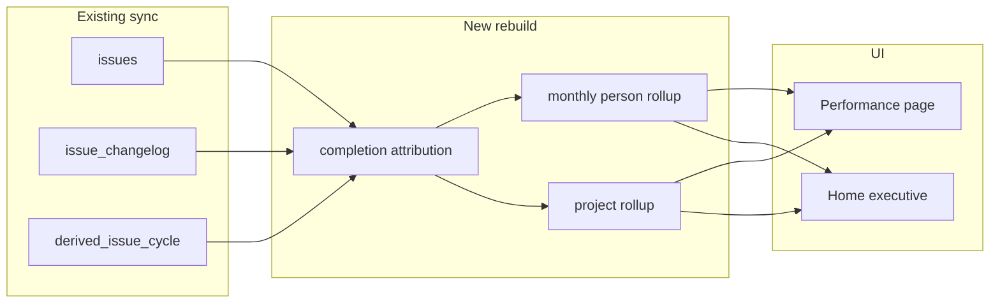

# Performance Analytics + Insights UI Implementation Plan

> **For agentic workers:** REQUIRED SUB-SKILL: Use superpowers:subagent-driven-development (recommended) or superpowers:executing-plans to implement this plan task-by-task. Steps use checkbox (`- [ ]`) syntax for tracking.

**Goal:** Ship strong performance insights—velocity/throughput per developer and project, blockers per project, ticket counts, and tickets-per-person-per-month with rate change—behind a redesigned Home + new Performance page.

**Architecture:** Extend `ag_analytics` rebuild with completion-attribution + monthly rollups into new derived tables; expose read models via Tauri `get_performance_metrics`; redesign Home as an executive summary and add `/performance` as the primary insights board. Existing Flow/Sprints/Epics stay as deep dives.

**Tech Stack:** Rust (`ag_analytics`, `ag_db`, Tauri commands), SQLite derived tables, React/Vite UI with existing FilterBar + A&G brand CSS.

**Locked decisions:**
- Attribution: **hybrid** — assignee at Done transition from changelog when present; else current `issues.assignee_account_id`
- UI scope: **new Performance page + redesigned Home** (not a full redesign of every page in v1)
- Velocity primary unit: **completed tickets** (story points shown as secondary where available)
- Blockers: **issues currently in status matching `%block%` / `%imped%`**, counted per project (same heuristic as epic risk); blocked *time* as secondary metric

## Global Constraints

- Preserve local-only model; no backend
- Reuse `MetricsFilter` (`project_keys`, `from`, `to`, `issue_types`, `assignee_ids`)
- TDD for analytics queries and UI smoke tests
- Keep A&G brand tokens in [`ui/src/styles.css`](ui/src/styles.css)
- Rebuild derived runs through existing `rebuild_all_derived` / maintenance path
- Display names: show `assignee_account_id` until a users map exists; format as truncated id with tooltip of full id (no new Jira user sync in this plan)

## Metric definitions

| Metric | Definition |
|--------|------------|
| Completions | Issues with `derived_issue_cycle.completed_at` in range |
| Finisher | From changelog: last `assignee` value at/before the status change that marks done; else `issues.assignee_account_id` |
| Velocity / throughput | Count of completions (optional sum of `story_points` as `points`) |
| Tickets per project | Open + completed counts by `project_key` under filter |
| Blockers per project | Count of issues whose current `status` matches block/imped heuristic, grouped by project |
| Tickets/person/month | Completions attributed to finisher, bucketed by UTC `YYYY-MM` of `completed_at` |
| Rate change | `(this_month - prev_month) / prev_month` when prev &gt; 0; else null |



## File map

| Path | Role |
|------|------|
| [`crates/ag_db/src/schema.sql`](crates/ag_db/src/schema.sql) + migration | New derived tables |
| [`crates/ag_analytics/src/attribution.rs`](crates/ag_analytics/src/attribution.rs) | Finisher resolution from changelog |
| [`crates/ag_analytics/src/performance.rs`](crates/ag_analytics/src/performance.rs) | Pure aggregations |
| [`crates/ag_analytics/src/rebuild.rs`](crates/ag_analytics/src/rebuild.rs) | Write derived performance tables |
| [`src-tauri/src/commands/metrics.rs`](src-tauri/src/commands/metrics.rs) | `get_performance_metrics` |
| [`ui/src/pages/PerformancePage.tsx`](ui/src/pages/PerformancePage.tsx) | Insights board |
| [`ui/src/pages/HomePage.tsx`](ui/src/pages/HomePage.tsx) | Executive summary redesign |
| [`ui/src/components/DashboardNav.tsx`](ui/src/components/DashboardNav.tsx) | Add Performance link |
| [`ui/src/App.tsx`](ui/src/App.tsx) | Route `/performance` |
| [`ui/src/lib/tauri.ts`](ui/src/lib/tauri.ts) | IPC types + `getPerformanceMetrics` |
| [`ui/src/styles.css`](ui/src/styles.css) | Performance/Home layout (non-card-heavy, brand-aligned) |
| [`docs/superpowers/specs/2026-07-23-performance-analytics-design.md`](docs/superpowers/specs/2026-07-23-performance-analytics-design.md) | Short design note (metric defs) |

Also save this plan to [`docs/superpowers/plans/2026-07-23-performance-analytics-ui.md`](docs/superpowers/plans/2026-07-23-performance-analytics-ui.md) when executing.

---

### Task 1: Schema + migration for performance derived tables

**Files:**
- Modify: `crates/ag_db/src/schema.sql`
- Modify: migration path used by `ag_db::migrate` (same pattern as existing version bumps)
- Test: `crates/ag_db` migration tests if present; else add assert tables exist after migrate

**Produces:** tables usable by rebuild

- [ ] **Step 1: Add tables to schema**

```sql
CREATE TABLE IF NOT EXISTS derived_completions (
    issue_id TEXT PRIMARY KEY NOT NULL,
    project_key TEXT NOT NULL,
    completed_at TEXT NOT NULL,
    finisher_account_id TEXT,
    story_points REAL,
    attribution TEXT NOT NULL -- 'changelog' | 'current'
);

CREATE INDEX IF NOT EXISTS idx_derived_completions_finisher_month
  ON derived_completions (finisher_account_id, completed_at);
CREATE INDEX IF NOT EXISTS idx_derived_completions_project
  ON derived_completions (project_key, completed_at);

CREATE TABLE IF NOT EXISTS derived_person_month (
    month TEXT NOT NULL,           -- YYYY-MM
    account_id TEXT NOT NULL,
    completed_count INTEGER NOT NULL,
    points REAL,
    PRIMARY KEY (month, account_id)
);

CREATE TABLE IF NOT EXISTS derived_project_stats (
    project_key TEXT PRIMARY KEY NOT NULL,
    open_count INTEGER NOT NULL,
    completed_count INTEGER NOT NULL,  -- all-time in derived set; filtered at query
    blocker_count INTEGER NOT NULL,
    blocked_secs_total INTEGER NOT NULL DEFAULT 0
);
```

Note: `derived_project_stats` stores **current** open/blocker snapshot; completed counts for date ranges come from `derived_completions` at query time. Keep `derived_project_stats` for open + blockers only if simpler—or compute open/blockers live in SQL from `issues` and only materialize completions. **Chosen approach:** materialize `derived_completions` + `derived_person_month`; compute open/blockers live from `issues`/`derived_time_in_status` in the query layer (avoids stale open counts). Drop `derived_project_stats` from schema; use live SQL for open/blockers.

Final tables: **`derived_completions`**, **`derived_person_month`** only.

- [ ] **Step 2: Bump schema version / migrate idempotently**
- [ ] **Step 3: Test migrate creates tables**
- [ ] **Step 4: Commit** `feat(db): add performance derived tables`

---

### Task 2: Hybrid finisher attribution (TDD)

**Files:**
- Create: `crates/ag_analytics/src/attribution.rs`
- Modify: `crates/ag_analytics/src/lib.rs`
- Test: unit tests in `attribution.rs`

**Produces:** `resolve_finisher(assignee_changelog, status_done_at, current_assignee) -> (Option<String>, AttributionSource)`

- [ ] **Step 1: Failing tests** — changelog assignee present at Done → that id + `Changelog`; no changelog → current + `Current`; unassigned → `None` + `Current`
- [ ] **Step 2: Implement** using status-done timestamp from cycle rebuild (same done detection as cycle/lead)
- [ ] **Step 3: Pass tests + commit** `feat(analytics): hybrid completion finisher attribution`

---

### Task 3: Rebuild completions + person-month rollups

**Files:**
- Modify: `crates/ag_analytics/src/rebuild.rs` — add `rebuild_performance_derived`, call from `rebuild_all_derived`
- Create: `crates/ag_analytics/src/performance.rs` for pure month bucketing helpers if useful

**Produces:** populated derived tables after rebuild/sync

- [ ] **Step 1: Failing integration test** with fixture issues + changelog + cycle rows → expected `derived_completions` / `derived_person_month` rows
- [ ] **Step 2: Implement rebuild** iterating completed issues, loading assignee changelog per issue, inserting completions, aggregating months
- [ ] **Step 3: Wire into sync path** so full/incremental derived rebuild includes performance (same call site as throughput rebuild)
- [ ] **Step 4: Commit** `feat(analytics): rebuild performance completions and person-month`

---

### Task 4: `get_performance_metrics` Tauri command

**Files:**
- Modify: `src-tauri/src/commands/metrics.rs`
- Modify: `src-tauri/src/commands/mod.rs`, `src-tauri/src/lib.rs` (register command)
- Test: command-level tests with tempfile DB

**Produces:**

```rust
pub struct PerformanceMetricsDto {
    pub by_person: Vec<PersonVelocityDto>,      // completed_count, points, account_id
    pub by_project: Vec<ProjectPerfDto>,        // open, completed_in_range, blockers, blocked_secs
    pub person_month: Vec<PersonMonthDto>,      // month, account_id, completed_count, points, rate_change
    pub project_month: Vec<ProjectMonthDto>,    // month, project_key, completed_count
}
```

- [ ] **Step 1: Failing tests** for filter by project/date and rate_change math
- [ ] **Step 2: Implement SQL** against `derived_completions` + live blocker/open queries
- [ ] **Step 3: Register IPC** `get_performance_metrics`
- [ ] **Step 4: Commit** `feat(tauri): expose get_performance_metrics`

---

### Task 5: UI IPC + Performance page (TDD)

**Files:**
- Modify: `ui/src/lib/tauri.ts`
- Create: `ui/src/pages/PerformancePage.tsx`, `PerformancePage.test.tsx`
- Modify: `DashboardNav.tsx`, `App.tsx`
- Modify: `ui/src/styles.css` — performance layout (summary strip + ranked tables/charts; avoid hero cards clutter; use existing brand vars)

**Produces:** `/performance` with FilterBar; sections: People velocity, Project breakdown (tickets/blockers), Person×month with rate change, Project×month

- [ ] **Step 1: Failing RTL test** — mocks `getPerformanceMetrics`, asserts section headings and a person row
- [ ] **Step 2: Implement page** + nav link **Performance** (place after Home)
- [ ] **Step 3: Pass tests + commit** `feat(ui): add Performance insights page`

---

### Task 6: Redesign Home as executive summary

**Files:**
- Modify: `ui/src/pages/HomePage.tsx`, `HomePage` tests if any / `App.test.tsx`
- Modify: `ui/src/styles.css`

**Produces:** Home shows: top movers (person month rate), top projects by completions, blocker hotspot projects, links to `/performance` and `/flow`. Keep existing cycle/throughput snippets only as secondary one-liners—not a duplicate Flow page.

- [ ] **Step 1: Wire Home to `getPerformanceMetrics` + existing flow summary**
- [ ] **Step 2: Visual polish** — denser insight layout, clear hierarchy, A&G red accents for deltas
- [ ] **Step 3: Tests + commit** `feat(ui): redesign Home as performance executive summary`

---

### Task 7: Ask AI context pack enrichment

**Files:**
- Modify: `crates/ag_bedrock/src/context.rs` (or build pack inputs) to include top person/project throughput lines from derived tables when present
- Test: context pack includes a person/project line in fixture

- [ ] **Step 1–3: TDD + commit** `feat(ai): include performance rollups in context pack`

---

### Task 8: Spec + manual QA checklist

**Files:**
- Create: `docs/superpowers/specs/2026-07-23-performance-analytics-design.md`
- Update: `docs/release/install.md` or macos QA list with Performance checks

- [ ] Document metric defs + attribution caveat
- [ ] Manual QA: rebuild derived → Performance populates; filter by project; rate_change after 2 months of fixture data
- [ ] Commit `docs: performance analytics design and QA`

---

## Out of scope (explicit)

- Syncing Jira display names / avatars
- Syncing `issue_links` for formal “blocks” link type
- Full visual redesign of Flow/Sprints/Epics/Explore
- Story-point-only velocity as primary metric
- Windows NSIS default bundle target

## Self-review

- Spec coverage: all five user metrics mapped to Tasks 3–6
- Attribution hybrid: Task 2–3
- Home + Performance UI: Tasks 5–6
- No placeholders left in task bodies
- Types consistent: `PerformanceMetricsDto` used in Tauri + UI tasks
